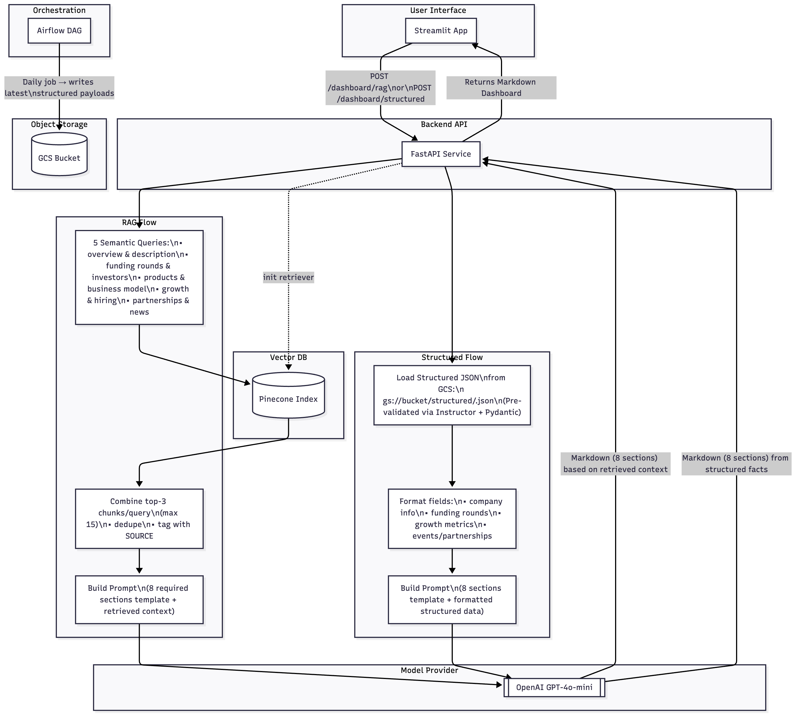

# 🚀 Project ORBIT — PE Dashboard for Forbes AI 50  
### *DAMG7245 — Assignment 2 | Northeastern University*

> 🟢 **Live Dashboard:** *[https://pe-dashboard-ui-ca7qaibdpa-uc.a.run.app/]*
> 🎥 **Demo Video:** *[https://northeastern-my.sharepoint.com/:v:/g/personal/gandhi_di_northeastern_edu/ERbw5r7rYJ9DmqTFlHo7Kp8BJcuYJRMsHnNscO-dYMLyaA?e=xmmzAs&nav=eyJyZWZlcnJhbEluZm8iOnsicmVmZXJyYWxBcHAiOiJTdHJlYW1XZWJBcHAiLCJyZWZlcnJhbFZpZXciOiJTaGFyZURpYWxvZy1MaW5rIiwicmVmZXJyYWxBcHBQbGF0Zm9ybSI6IldlYiIsInJlZmVycmFsTW9kZSI6InZpZXcifX0%3D]*  

---

## 📘 Overview  

**Project ORBIT — PE Dashboard** is an end-to-end data intelligence system that ingests, structures, and evaluates information for the **Forbes AI 50 companies**.  
It combines **ETL automation, AI data extraction, and evaluation pipelines** to build a dynamic investor-style dashboard that visualizes structured company profiles and evaluation metrics.  

This project demonstrates complete integration between:  
- 🧩 **FastAPI backend** for serving company data  
- 🧠 **LangChain-based RAG and Structured extraction** for text synthesis  
- ⚙️ **Airflow DAGs** for daily refresh automation  
- 🌐 **Streamlit UI** for interactive visualization  
- ☁️ **Terraform + GitHub Actions + Google Cloud Run deployment**  

---

## Architecture Diagram  



---

## 🧩 Repository Structure  

```
pe-dashboard-ai50/
├── app.py                        # FastAPI application entry point
├── streamlit_app.py              # Streamlit dashboard interface
├── dashboard_prompt.txt          # Dashboard UI prompt templates
├── docker-compose.yml            # Combined Streamlit + FastAPI container setup
├── Dockerfile.fastapi            # API service Dockerfile
├── Dockerfile.streamlit          # UI service Dockerfile
├── dags/                         # Airflow DAGs for scheduled refresh
├── data/                         # Raw + processed + payload data
├── src/                          # Core source code
├── terraform/                    # Infrastructure as Code (Cloud Run, Storage, SQL)
├── .github/workflows/            # GitHub Actions CI/CD for deployment
├── requirements.txt
├── README.md
├── EVAL.md
└── reflection_lab9.md
```

---

## ⚙️ Run Locally (Dev Mode)

```bash
# 1️⃣ Create and activate virtual environment
python -m venv .venv
source .venv/bin/activate

# 2️⃣ Install dependencies
pip install -r requirements.txt

# 3️⃣ Run FastAPI backend
uvicorn src.api:app --reload
# API available at http://localhost:8000

# 4️⃣ In another terminal, launch Streamlit UI
streamlit run src/streamlit_app.py
# Dashboard available at http://localhost:8501
```

---

## 🐳 Run with Docker

```bash
# Build and run both FastAPI + Streamlit containers
docker compose up --build
```

This starts:

- **Streamlit** → [https://pe-dashboard-ui-ca7qaibdpa-uc.a.run.app/] 

---

## ☁️ Cloud Deployment (Terraform + GitHub Actions + Cloud Run)

You can deploy the app using **Terraform + Google Cloud Run + GitHub Actions**:

1. Configure credentials in your Terraform backend (`terraform/variables.tf`).  
2. Deploy infrastructure via:  
   ```bash
   cd terraform
   terraform init
   terraform apply
   ```  
3. **Terraform** provisions all required cloud resources — including Cloud Run services, Cloud SQL database, and GCS buckets.  
4. **GitHub Actions** automates CI/CD — once new code is pushed to the main branch, it triggers deployment, builds Docker images, and updates the running containers on Cloud Run automatically.  
5. Cloud Run hosts both **FastAPI** and **Streamlit** containers for scalable access.  
6. The daily **Airflow DAG** refreshes `data/payloads/` for the dashboard, keeping the live app synced with new data.  

> 🧩 *All DAGs are Composer-ready for automated, production-scale scheduling.*

---

## 🧪 Evaluation  

Each company was scored on a **10-point rubric** (Factual 3, Schema 2, Provenance 2, Hallucination 2, Readability 1).  

📊 **Average Results:**
- RAG Pipeline → 7.2 / 10  
- Structured Pipeline → 10 / 10  

📄 Full details in [`EVAL.md`](EVAL.md).  

---

## 💡 Key Features  

- 🌍 Multi-source scraping (Forbes AI 50, Crunchbase, TechCrunch, LinkedIn)  
- ⚙️ Intelligent extraction via **Requests → Selenium → Playwright fallback**  
- 🧠 RAG vs Structured data comparison  
- 📈 Quantitative evaluation with automated scoring  
- 🌐 Streamlit dashboard for company exploration  
- ☁️ CI/CD via Terraform + GitHub Actions for reproducible cloud deployment  

---

## 🧱 Tech Stack  

| Layer | Tools |
|:------|:------|
| **Backend** | Python 3.10 • FastAPI • LangChain • Pinecone • OpenAI Embeddings |
| **Frontend** | Streamlit • Plotly • Pandas |
| **Infra / DevOps** | Docker • Terraform • GitHub Actions • GCP (Cloud Run + Cloud Storage + Cloud SQL) |
| **Automation** | Apache Airflow / Composer • DAG-based refresh |
| **Data Quality** | JSON schema validation • rubric scoring • provenance tracking |

---

## 📺 Demo Video  

🎥 *[https://northeastern-my.sharepoint.com/:v:/g/personal/gandhi_di_northeastern_edu/ERbw5r7rYJ9DmqTFlHo7Kp8BJcuYJRMsHnNscO-dYMLyaA?e=xmmzAs&nav=eyJyZWZlcnJhbEluZm8iOnsicmVmZXJyYWxBcHAiOiJTdHJlYW1XZWJBcHAiLCJyZWZlcnJhbFZpZXciOiJTaGFyZURpYWxvZy1MaW5rIiwicmVmZXJyYWxBcHBQbGF0Zm9ybSI6IldlYiIsInJlZmVycmFsTW9kZSI6InZpZXcifX0%3D]*  
Explains data ingestion → evaluation → dashboard visualization flow.

---

## 🧩 CodeLabs  

🔗 [View CodeLab →](index.html)
Step-by-step guide through pipeline design and evaluation.

---

## 🏁 Summary  

Project ORBIT – PE Dashboard showcases a complete **AI data engineering pipeline**, integrating web scraping, knowledge extraction, structured evaluation, and live visualization.  

The project demonstrates how **structured pipelines** outperform generative ones in factual reliability while **RAG models** provide rich contextual insights — together creating a balanced, production-grade data intelligence system.
